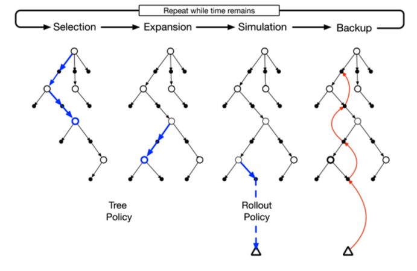

# Monte Carlo Tree Search - Connect X - Agent

Este projeto consiste de um agente autônomo capaz de jogar partidas do jogo [Connect Four](https://en.wikipedia.org/wiki/Connect_Four) com a variante PopOut para a eletiva de [Agentes Autônomos e Reinforcement Learning](http://fbarth.net.br/agents/).

----

## Setup do ambiente para execução do agente

Configure um ambiente virtual:

```
python3 -m virtualenv venv
source venv/bin/activate
```

Instalando dependências:

```
python3 -m pip install --upgrade pip
pip install -r requirements.txt
```

Execute o FourInRow.py e você deve conseguir jogar contra o agente.

Um torneio pode ser criado através da chamada:

```
python Tournament.py > logs/competicao_results.log &
```

E resultados como o vencedor podem ser vistos da seguinte forma:

```
cat logs/competicao_results.log | grep -e 'winner\|vs'
```

## Lógica do Agente

O agente desenvolvido utiliza um algoritmo de busca em uma árvore construída a partir do algoritmo de Monte Carlo, chamado Monte Carlo Tree Search (MCTS), que ganhou notoriedade depois de ter sido implementado no modelo AlphaGo Zero da Google que derrotou o então campeão mundial de Go em 2016 e um artigo para entender como isso foi feito pode ser lido nas referências ao fim.

O MCTS utiliza da inteligência do modelo Monte Carlo para selecionar o nó mais promissor em um árvore através de alguma regra que será explicada mais ao fim e, ao contrário de um algoritmo de busca cega uniforme, o modelo de Monte Carlo gera estados futuros aleatoriamente, dessa forma explorando caminhos que demorariam muito a serem verificados e testados em um problema de busca cega.

O algoritmo consiste fundamentalmente de quatro etapas:

- Seleção: nessa etapa o algoritmo seleciona o nó mais promissor a partir da raiz da árvore
- Expansão: nessa etapa o algoritmo expande o nó escolhido através de mais movimentos aleatórios
- Simulação: nessa etapa o algoritmo simula o destino da partida a partir dos nós gerados pela expansão através de uma regra chamada *policy* que é o que adiciona "inteligência" ao algoritmo. Nessa implementação a *policy* usada será a Upper Confidence Trees (UCT), uma função de seleção baseada no número de nós visitados e o score do nó atual e o formalismo matemático será deixado para as [referências](#referências)
- Atualização: através de um algoritmo de *backpropagate*, todos os nós no caminho entre o nó final e a raiz são atualizados com um novo valor para a *policy*

E repetimos isso até achar um nó vencedor, a imagem abaixo representa bem esse processo:



## Validação
Como seria preciso criar outros agentes inteligentes para o jogo para poder validar, será usada uma *proxy* de uma validação do agente jogando o Connect Four regular contra os agentes do ambiente de competição do Kaggle que consiste de um agente randômico e um agente inteligente utilizando um algoritmo de decisão negamax.

A validação pode ser feita executando o arquivo test.py e é esperado o seguinte resultado:

```
Simulation outcomes for 100 played games between Carlos Monteiro x Random
Carlos Monteiro win rate: 0.98
Carlos Monteiro loss rate: 0.0
Draw rate: 0.02
Number of Invalid Plays by Carlos Monteiro: 0
Number of Invalid Plays by Random: 0

Simulation outcomes for 100 played games between Carlos Monteiro x Negamax
Carlos Monteiro win rate: 0.87
Carlos Monteiro loss rate: 0.01
Draw rate: 0.12
Number of Invalid Plays by Carlos Monteiro: 0
Number of Invalid Plays by Negamax: 0
```

**E isso deve demorar da ordem de algums horas, então não rodar por um motivo qualquer.**

## Referências

- [História do MCTS e AlphaGo Zero](https://jonathan-hui.medium.com/monte-carlo-tree-search-mcts-in-alphago-zero-8a403588276a)
- [Referência principal a MCTS](https://en.wikipedia.org/wiki/Monte_Carlo_tree_search)
- [Referência mais didática a MCTS](https://towardsdatascience.com/monte-carlo-tree-search-an-introduction-503d8c04e168)
- [Mais sobre MCTS e UCT](https://medium.com/@quasimik/monte-carlo-tree-search-applied-to-letterpress-34f41c86e238)
- [Implementação de MCTS para Connect Four regular, adaptados trechos como cálculo do UCT e nós da árvore](https://www.kaggle.com/code/matant/monte-carlo-tree-search-connectx/notebook)
- [Ambiente competitivo Kaggle](https://pypi.org/project/kaggle-environments/)

----

## Respostas ao enunciado (referente a correção da entrega final)

1. **Que algoritmo deve ser utilizado para desenvolver um agente jogador de Connect4 PopOut vencedor? Deve-se utilizar uma implementação de Min-Max com poda alpha-beta? Se sim, qual a profundidade que deverá ser utilizada para evitar processamentos superiores a 10 segundos por jogada? Qual a função de utilidade que deve ser utilizada?**

**Re.:** O algoritmo usado foi MCTS, explicado em [Lógica do agente](#lógica-do-agente).

2. **O seu jogador faz uso de alguma base de conhecimento? Se sim, como ela é utilizada durante o processo de tomada de decisão?**

**Re.:** Não.

3. **Foi utilizada alguma função de utilidade não definida manualmente, por exemplo, alguma função de utilidade gerada a partir de um processo de aprendizagem de máquina supervisionado? Se sim, como é que foi o treinamento desta função de utilidade? Como foi feita a integração desta função de utilidade com o restante do código?**

**Re.:** Não utiliza uma função de utilidade propriamente dita e sim uma policy, explicado em [Lógica do agente](#lógica-do-agente).

4. **Qual a sua expectativa com relação ao desempenho do seu agente? Você acredita que ele irá desempenhar bem na competição? Por que? Você executou testes contra outros jogadores? Qual foram os resultados?**

**Re.:** Coberto na [validação](#validação).

5. **Quais foram as principais referências utilizadas para a implementação do seu jogador?**

**Re.:** Podem ser vistas em [referências](#referências).

6. **Existem diferenças significativas entre um jogador de Connect4 e um jogador de Connect4 PopOut em termos de árvore de busca e função de avaliação? É possível utilizar o jogador implementado para o Connect4 PopOut em competições de Connect4 sem muitas modificações?**

**Re.:** Não existem diferenças significativas além do comprimento da árvore de busca já que a árvore de busca para o Connect Four regular tem coeficiente de bifurcação limitado superiormente por 7 e o Connect Four PopOut é limitado superiormente por 13, as sete colunas regulares e mais seis opções de pop que é o máximo possível de colocar na linha mais de baixo sem ganhar a partida. Como visto na [validação](#validação), não é difícil adaptar e isso foi feito para gerar a mesma.
